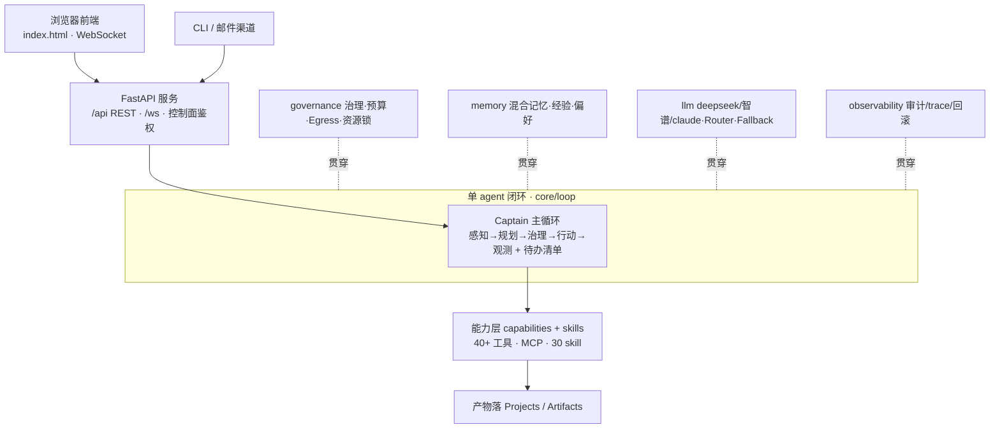

# Captain · 架构总览

> 一个跑在 DeepSeek / 智谱等模型上的**单 agent** 平台:听懂目标 → 自己顺序拆解执行 → 治理可审计。
> 后端纯 Python,前端单文件原生 HTML/JS。

## 技术栈

| 领域 | 选型 |
|---|---|
| 语言/运行时 | Python 3.10+ |
| Web 服务 | FastAPI + uvicorn + websockets(`/api/*` REST + `/ws` 实时流)|
| 前端 | **单文件原生 HTML/JS**(`frontend/index.html`,无框架,自管 i18n)|
| LLM | OpenAI SDK(DeepSeek / 智谱走 OpenAI 兼容协议)+ Anthropic SDK(Claude);`tiktoken` 计 token |
| 存储/记忆 | SQLite(会话、定时任务)+ `sqlite-vec` + `numpy`(向量记忆)|
| 配置 | YAML(治理策略、persona)+ `.env`(`make config` 向导生成)|
| 渠道 | `aiohttp`(web 搜索/抓取)、`aiosmtplib`/`aioimaplib`(邮件)|
| Office | `python-docx` / `python-pptx` / `openpyxl` / `pypdf`(`[office]` 可选)|
| 测试 | pytest(56 个测试文件,220+ 用例)+ pytest-cov 覆盖率 |
| 部署 | launchd 自启(mac)/ Docker;`scripts/launch.sh` 启动器 |

## 模块分布(后端约 23,000 行 + 前端 7,000 行)

| 模块 | 职责 |
|---|---|
| **capabilities** | agent 的"手":40+ 工具(fs/shell/web/browser/git/calendar/image/plan/schedule/monitor/secret…)+ MCP 连接器 + skill |
| **server** | FastAPI app + WebSocket + `/api` 端点(`routers/` 分组)+ runtime 配置 + 模型管理 + 用量统计 |
| **memory** | 混合记忆(关键词 + 向量)+ 经验/偏好沉淀 + 目标/反馈/检查点/项目/模板/日历/加密保险库/Journal |
| **core** | Agent 主循环(loop)、Context、prompts、presets(分人群)、bootstrap 装配、简报、事件总线 |
| **skills** | 30 个能力插件(docx/pptx/xlsx/pdf/会议纪要/周报/邮件/通知/搜索/写作/设计…),目录化自动发现 + 懒加载 |
| **channels** | 外部渠道(邮件 + Web)+ CLI 交互 + 配置存储 |
| **llm** | 各 provider 适配(deepseek/智谱/openai/claude/ollama/mock)+ Router + Fallback 降级 + 重试退避 + 流式 |
| **governance** | 声明式策略引擎(硬边界 / 确认门 / 白名单)+ Budget 预算 + Egress 审查 + 资源锁 |
| **observability** | 审计日志、trace、回滚、transcript |
| **scheduler** | 定时任务调度循环 + 存储 |
| **agents** | 仅剩 `commands.py`(斜杠命令解析);多 agent 编排已移除 |
| **evals** | 40 例真实任务评测 + judge + scoring + 稳定率检测 |
| **tests** | 56 个回归测试文件 |

## 请求主线(单 agent 顺序闭环)

```
浏览器前端 (WS) / CLI / 邮件渠道
        ↓
FastAPI 服务 (server)  ——  /api REST · /ws WebSocket · 控制面鉴权
        ↓
core/loop = 单个 Captain 主循环(感知 → 规划 → 治理 → 行动 → 观测)
   · 多步任务先用 plan.update 列待办,再一件件顺序做完(不派活给别的 agent)
   · 每个动作先过治理;失败重规划;卡死/反复失败自动收尾
        ↓
能力层 (capabilities + skills)
   fs · shell · web(搜索/抓取) · browser · git · calendar · image · plan
   · schedule · memory · notify(邮件) · monitor · secret · 30 个 skill 插件 · MCP
        ↓
产物落 Projects / Artifacts(工作区 产物/ 目录)

横切(贯穿每一步):governance 治理·预算·Egress | memory 混合记忆 | llm 重试+降级 | observability 审计/trace
```

## Mermaid 源码



## 设计要点

- **单 agent,顺序执行**:一个 Captain 从头干到尾,用 `plan.update` 维护待办清单一件件勾掉。
  早期的多 agent / map-reduce DAG / 子代理(researcher/executor)编排**已移除**——DeepSeek 在多会话并发下
  持续 Connection error / timeout,单 agent 顺序执行是实测最稳、也最易观测和调试的形态。
- **统一能力管线**:调工具、跑 skill、控 GUI、走 MCP 都收敛成 `CapabilityCall`,治理层只有一个收口要审查——
  加再多能力,安全模型也不分裂。Agent 只认 Capability Registry,不关心 `shell.py` 在哪。
- **安全由代码保证,不靠 prompt**:硬边界写在 `governance/`,模型无法绕过;风险分级(READ/WRITE/DESTRUCTIVE/FORBIDDEN)决定是否打扰。
- **事件总线**:单向通知走 `core/bus`,双向确认走回调;`server/events.to_wire` 是前后端契约;trace/transcript 全程可回看。
- **健壮性**:失败重规划、卡死检测(同名同参重复)、防 thrash(同一能力反复失败即收尾)、抗谄媚(迎合压力时机制级提醒)。
- **模型面向接口**:换厂商 / 本地只改 `llm/factory.py`;Router + Fallback 提供多模型路由与失败降级。
