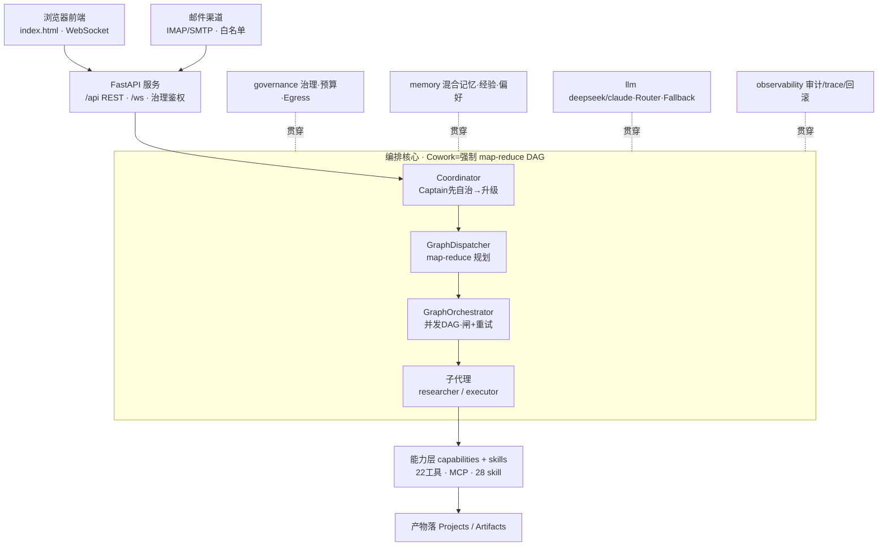

# Captain · 架构总览

> 一个跑在 DeepSeek 上的多智能体平台：听懂目标 → 自己拆解执行 → 治理可审计。
> 后端纯 Python，前端单文件原生 HTML/JS。

## 技术栈

| 领域 | 选型 |
|---|---|
| 语言/运行时 | Python 3.10+ |
| Web 服务 | FastAPI + uvicorn + websockets（`/api/*` REST + `/ws` 实时流）|
| 前端 | **单文件原生 HTML/JS**（`frontend/index.html`，无框架，自管 i18n）|
| LLM | OpenAI SDK（DeepSeek 走 OpenAI 兼容协议）+ Anthropic SDK（Claude）；`tiktoken` 计 token |
| 存储/记忆 | SQLite（会话、定时任务）+ `sqlite-vec` + `numpy`（向量记忆）|
| 配置 | YAML（治理策略、persona）|
| 渠道 | `aiohttp`（web 搜索/抓取）、`aiosmtplib`/`aioimaplib`（邮件）|
| 测试 | pytest（55 个测试文件）|
| 部署 | launchd 自启（mac）/ Docker；`scripts/launch.sh` 启动器 |

## 模块分布（后端约 22,000 行 + 前端 7,000 行）

| 模块 | 行数 | 职责 |
|---|---|---|
| **capabilities** | ~3,680 | agent 的"手"：22 个工具（fs/shell/web/browser/git/calendar/plan/schedule/monitor/secret…）+ MCP 连接器 + skill 委托 |
| **server** | ~2,760 | FastAPI app + WebSocket + 所有 `/api` 端点、runtime 配置、模型管理、用量统计 |
| **memory** | ~2,240 | 混合记忆（关键词 + 向量）+ 经验/偏好沉淀 + 目标/反馈/检查点/项目/模板/秘密保险箱/Journal |
| **core** | ~1,990 | Agent 主循环（loop）、Context、prompts（含运行环境硬说明）、bootstrap 装配、简报、预设、事件总线 |
| **skills** | ~1,730 | 28 个能力插件（docx/pptx/xlsx/pdf/http/git/calendar/邮件/通知/搜索/写作/设计/周报/会议纪要…）|
| **channels** | ~1,380 | 外部渠道（邮件为主 + Web）+ CLI 交互（banner/prompt/style）+ 配置存储 |
| **llm** | ~1,090 | 各 provider 适配（openai/deepseek/claude/ollama/mock）+ Router + Fallback 降级 + 重试退避 + 流式 |
| **governance** | ~700 | 声明式策略引擎（硬边界 / 确认门 / 白名单）+ Budget 预算 + Egress 审查 + 分类器 + 资源锁 |
| **observability** | ~280 | 审计日志、trace、回滚、transcript |
| **scheduler** | ~200 | 定时任务调度循环 + 存储 |
| **agents** | ~140 | Cowork 编排命令（Captain → GraphDispatcher → GraphOrchestrator → 子代理）|
| **evals** | — | 40 例真实任务评测 + judge + scoring |
| **tests** | ~3,680 | 55 个回归测试文件 |

## 请求主线

```
浏览器前端 (WS) / 邮件渠道
        ↓
FastAPI 服务 (server)  ——  /api REST · /ws WebSocket · 治理鉴权
        ↓
编排核心 (agents)  ［Cowork 模式强制 map-reduce DAG］
   Coordinator ──► GraphDispatcher ──► GraphOrchestrator ──► 子代理
   (Captain先自治    (map-reduce 规划)   (并发DAG·闸+重试)     researcher /
    →用尽升级)                                              executor
   core/loop = Agent 主循环（感知→规划→调用→预算），每个动作先过治理
        ↓
能力层 (capabilities + skills)
   fs · shell · web(搜索/抓取) · browser · git · calendar · plan · schedule · memory
   · notify(邮件) · monitor · secret · skill 插件(28 个)
        ↓
产物落 Projects / Artifacts

横切（贯穿每一步）：governance 治理·预算 | memory 混合记忆 | llm 重试+降级 | observability 审计/trace
```

## Mermaid 源码



## 编排可靠性说明（重要）

Cowork 模式会强制走 map-reduce DAG（研究多个对象时：轻发现 → 每对象一个并行
researcher 节点 → 串行归约落盘）。实测 **DeepSeek 在多 agent 会话并发下会持续
Connection error / timeout**，因此并发上限 `AGENT_MAX_PARALLEL` 默认 **1（串行）**：
保留分工结构，但任一时刻只有一个会话访问模型服务——这是实测唯一稳定的条件。
换用更扛并发的模型端点后，可在 `.env` 调高 `AGENT_MAX_PARALLEL`。
